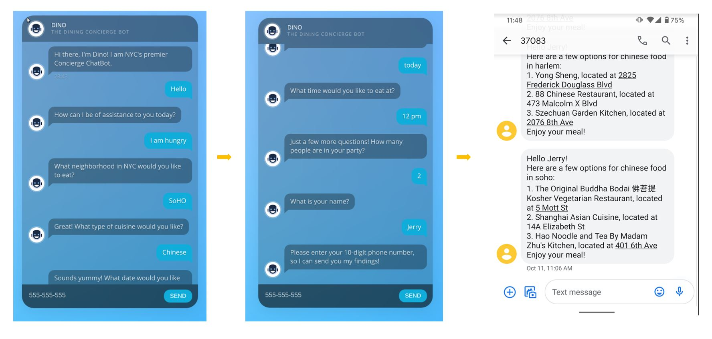

# AWS-Dining-Concierge-Chatbot

Contributors: Jerry Zhang, Wenhao Li

Customer Service is a core service for a lot of businesses around the world and it is
getting disrupted at the moment by Natural Language Processing-powered applications.
This project aims to  implement a serverless, microservice-driven web application. 
Specifically, a Dining Concierge chatbot, that sends you restaurant suggestions given a 
set of preferences that you provide the chatbot with through conversation

Based on a conversation with the customer, the LEX chatbot will identify the customer’s preferred ‘cuisine’. Their response then will search through ElasticSearch to get random suggestions of restaurant IDs with this cuisine. At this point, the backend queries the DynamoDB table with these restaurant IDs to find more information about the restaurants to suggest name and address of restauraunt recommendations.

Following image describes the AWS microservice architecture used to implement the web application

